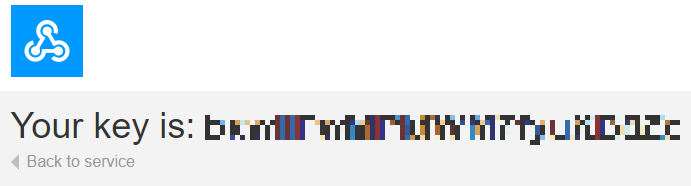
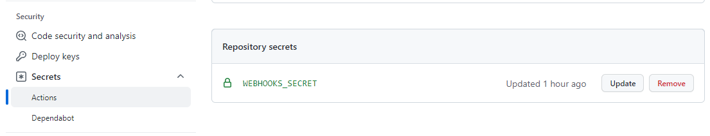
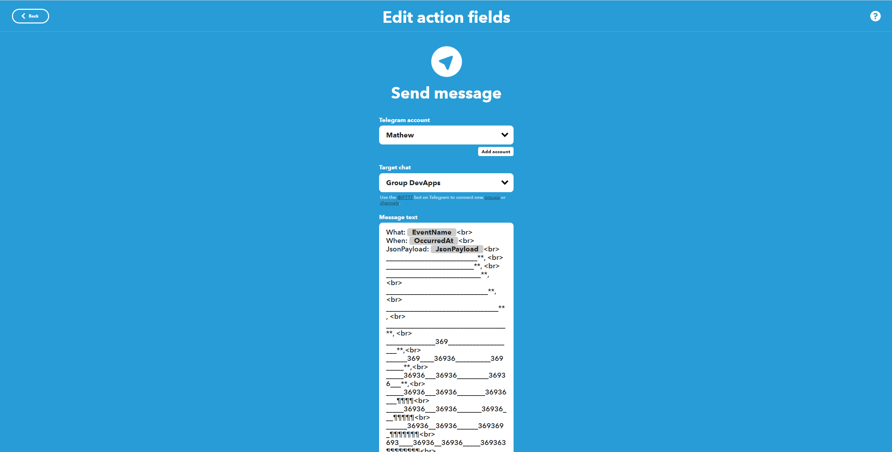
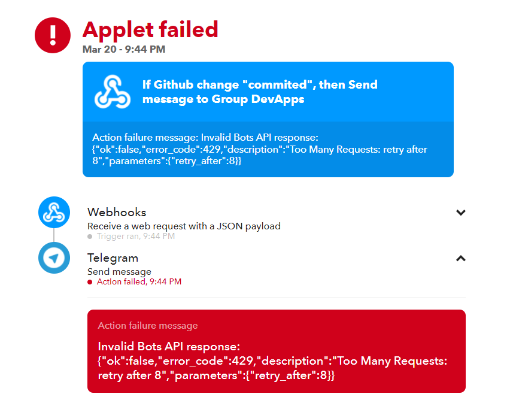

# DevApps

DevApps is a simple app created to send a notification to a telegram channel, DevApps, when changes are committed to this repository: [Availebla/DevApps](https://github.com/Availebla/DevApps).

## Getting Started

### Apps Used

* Github Actions Workflow
* IFTTT: If This Then That service
* Webhooks integrations: https://ifttt.com/maker_webhooks
* Telegram

### Executing program

1. Commit a change to this repository
2. Take a sip of coffee
3. Receive a telegram notification confirming that a change has been made


## How it works

The app utilizes github actions which runs a workflow every time a change is committed onto the main branch. This worflow is documented here: (.github/workflows/CICD.yml). The key line of code performs a POST web request with a JSON payload that is recieved by webhooks with a predefined event trigger and a personal key to connect to the IFTTT applet. The IFTT applet then posts a message to telegram (as shown in the screenshot above) to confirm a change has been made.

### The Essential Code
```
curl -X POST -H "Content-Type: application/json" -d '{"A change has been committed":"Kaboom!"}' https://maker.ifttt.com/trigger/commited/json/with/key/${{ secrets.WEBHOOKS_SECRET }}
```
Breaking down the code, there are few important components:
| Code Component | Description |
| ----------- | ----------- |
| ...'{"A change has been committed":"Kaboom!"}'... | This is the JSON Payload which is delivered to our IFTTT applet using the POST command. This can be modified to deliver other preferred messages. |
| ...trigger/commited/... | 'commited' is the pre-configured event name used to trigger our IFTTT applet, as shown here:  |
| ...${{ secrets.WEBHOOKS_SECRET }} | The IFTTT webhooks key is unique to your applet and should this repo be forked, will need to be replaced with your own Secret Key. The Unique Secret key can be found by visiting this page after you've created the applet on IFTTT https://maker.ifttt.com/use  |

The secret key is then added into the repository settings as a Key-Value pair:



## IFTTT

IFTTT makes it really easy to get the application up and running and provides the documentation you need to get your applet going. In this applet, if a Github change is "commited", then Send message to a telegram group called DevApps. The guides for using webhooks and telegram through IFTTT are listed below. 
* [Webhooks Service FAQ](https://help.ifttt.com/hc/en-us/articles/115010230347)
* [Using IFTTT with Telegram](https://help.ifttt.com/hc/en-us/articles/360003121113-How-to-get-started-using-IFTTT-with-Telegram)

To summarize for telegram - the following steps need to be performed in order starting from this page: https://ifttt.com/telegram
1. Click Connect to link telegram to IFTTT interface (action performed only 1st time)
2. In chat with IFTTT bot, click "Start", then "Authorize IFTTT"
3. Create a group chat/channel to be notified with, and add the bot: @IFTTT
4. Issue /start@IFTTT command
5. Issue /connect_group@IFTTT command
6. Done! You will now be able to select this group chat through the IFTTT applet

### The Payload

On IFTTT, an ASCII image was added (in HTML format, painstakingly created using line breaks) such that the telegram notification arrives with a beautiful image of a hand holding a tiny bomb (aka payload). This notification also contains the actual JSON payload as well as the Date & Time Stamp and the event name trigger:


## Challenges
An issue pertaining to the applet failing due to too many requests (limit implemented by Telegram's API) was seen, thus the testing had to be cooled off for a while:


## Acknowledgments

Inspiration, code snippets, etc.
* [U1i/ghactions-test](https://github.com/u1i/ghactions-test)
* [Github Actions secrets](https://www.youtube.com/watch?v=WuWsg0Ldess)
* [ASCII ART](https://text-symbols.com/ascii-art/)
* Stress Relief: [Wordle 274 6/6](https://www.nytimes.com/games/wordle/index.html)<br>
  ⬜⬜⬜🟩⬜ <br>
  ⬜⬜🟨🟩⬜ <br>
  ⬜⬜⬜🟩🟨 <br>
  ⬜🟨🟨🟩⬜ <br>
  🟩🟩⬜🟩⬜ <br>
  🟩🟩🟩🟩🟩 <br>
