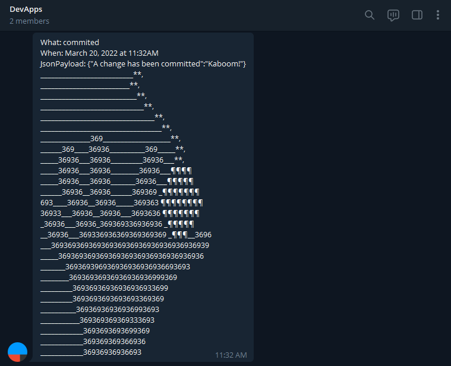
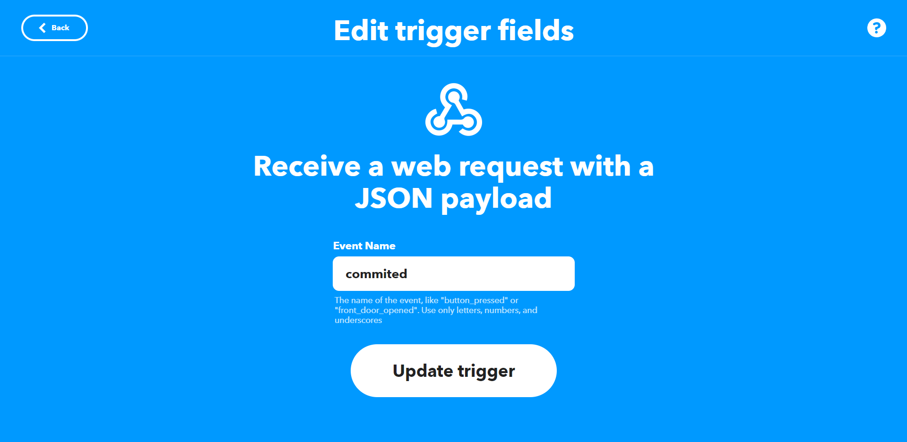

# DevApps

DevApps is a simple app created to send a notification to a telegram channel, DevApps, when changes are committed to this repository: [Availebla/DevApps](https://github.com/Availebla/DevApps).

## Getting Started

### Apps Used

* IFTTT: If This Then That service
* Github Actions Workflow
* Webhooks integrations: https://ifttt.com/maker_webhooks
* Telegram

### Executing program

1. Commit a change to the repository
2. Take a sip of coffee
3. Receive a telegram notification confirming that a change has been made



## How it works

The app utilizes github actions which runs a workflow every time a change is committed onto the main branch. This worflow is documented here: (.github/workflows/CICD.yml). The key line of code performs a POST web request with a JSON payload that is recieved by webhooks with a predefined event trigger and a personal key to connect to the IFTTT applet.

### how the sausage gets made
```
curl -X POST -H "Content-Type: application/json" -d '{"A change has been committed":"Kaboom!"}' https://maker.ifttt.com/trigger/commited/json/with/key/${{ secrets.WEBHOOKS_SECRET }}
```
Breaking down the code, there are few important components:
| Code | Description |
| ----------- | ----------- |
| '{"A change has been committed":"Kaboom!"}' | This is the JSON Payload which is delivered to our IFTTT applet using the POST command |
| trigger/commited/ | 'commited' is the pre-configured event name used to trigger our IFTTT applet |
| ${{ secrets.WEBHOOKS_SECRET }} | The IFTTT webhooks key is unique to your applet and should this repo be forked, will need to be replaced with your own Secret Key! |



## Authors

Contributors names and contact info

ex. Dominique Pizzie  
ex. [@DomPizzie](https://twitter.com/dompizzie)

## Version History

* 0.2
    * Various bug fixes and optimizations
    * See [commit change]() or See [release history]()
* 0.1
    * Initial Release

## License

This project is licensed under the [NAME HERE] License - see the LICENSE.md file for details

## Acknowledgments

Inspiration, code snippets, etc.
* [ASCII ART](https://text-symbols.com/ascii-art/)
* [Github Actions secrets](https://www.youtube.com/watch?v=WuWsg0Ldess)
* [zenorocha](https://gist.github.com/zenorocha/4526327)
* [fvcproductions](https://gist.github.com/fvcproductions/1bfc2d4aecb01a834b46)
* [Wordle 274 6/6](https://www.nytimes.com/games/wordle/index.html)

  ⬜⬜⬜🟩⬜

  ⬜⬜🟨🟩⬜

  ⬜⬜⬜🟩🟨

  ⬜🟨🟨🟩⬜

  🟩🟩⬜🟩⬜

  🟩🟩🟩🟩🟩
